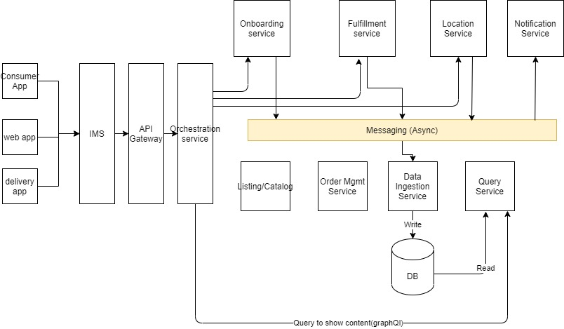

# foodies
Foodies Food Delivery Service

* [Architecture](#markdown-header-architecture)
* [Sequence Diagram](#markdown-header-sequence-diagram)

## Architecture

### Module Explanation

1. Consumer App, Delivery App and Web App to access Foodies service
2. **Onboarding Service** will be responsible for onboarding delivery personal and users
3. **Fulfillment Service** - To deliver prepared food to user 
4. **Location Service** - needed to assign trips, real-time tracking of an order, payment based on distance travelled etc. This component also interact with device resources such as GPS, network, bluetooth and other sensors for location tracking, proximity detection, distance travelled measurement, activity recognition etc.
5. **Notification Service**  - To notify delivery personal and user (push notification)
6. **Listing/Catalog Service** - To list restaurant and menus
7. **Order Management Service** - To Manage order e.g add to cart, call payment service, notify restaurant,

## Sequence Diagram
